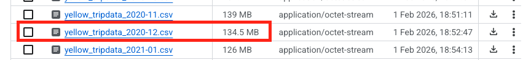
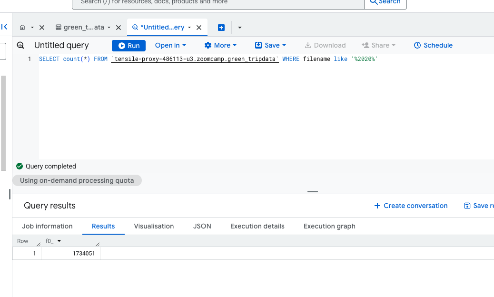
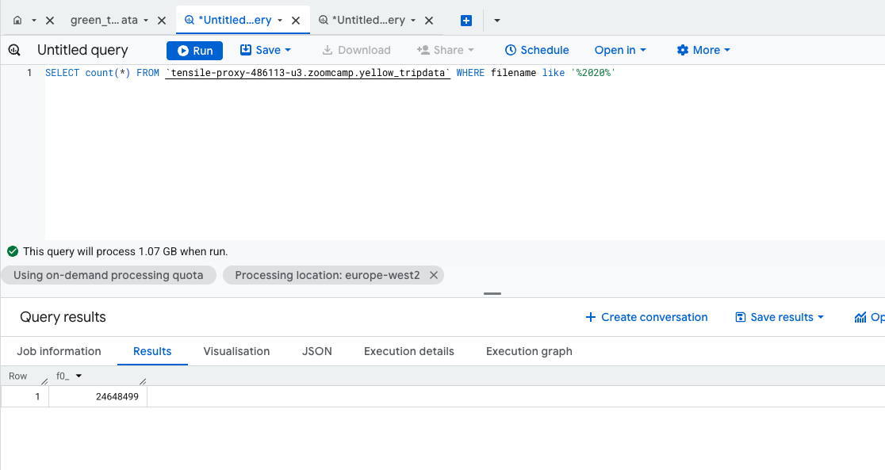
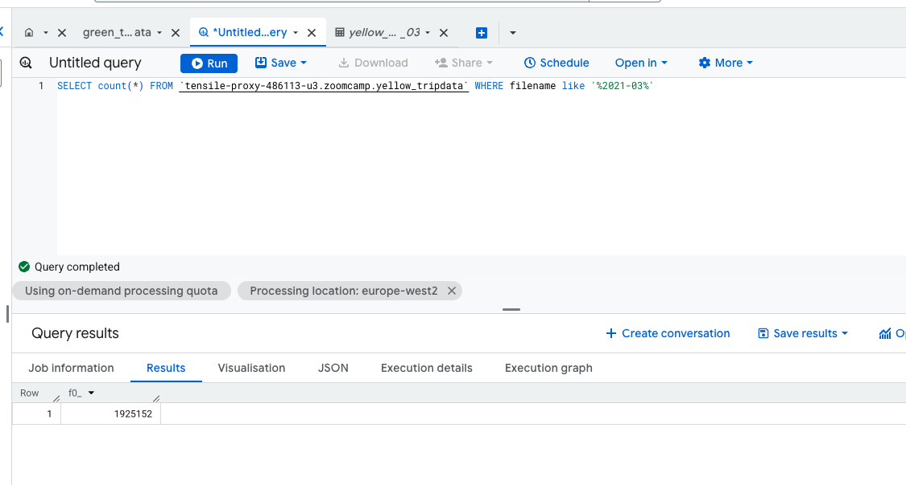
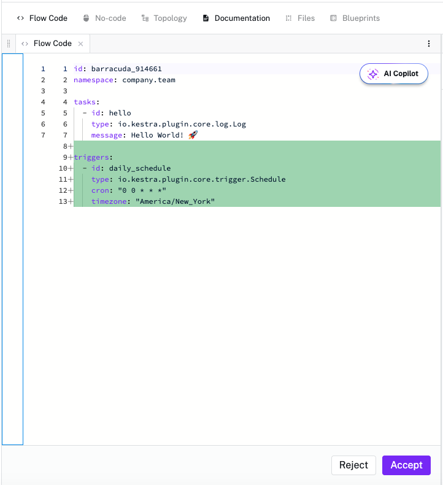

# data-engineer-homework

My Data Engineer Zoomcamp Homework 2

---

## Question 1. Within the execution for Yellow Taxi data for the year 2020 and month 12: what is the uncompressed file size (i.e. the output file yellow_tripdata_2020-12.csv of the extract task)?
134.5MB


## Question 2. What is the rendered value of the variable file when the inputs taxi is set to green, year is set to 2020, and month is set to 04 during execution?
Viariable expression: ```yaml {{inputs.taxi}}_tripdata_{{inputs.year}}-{{inputs.month}}.csv ```
Rendered value: green_tripdata_2020-04.csv

## Question 3. How many rows are there for the Yellow Taxi data for all CSV files in the year 2020?
```sql
SELECT count(*) FROM `tensile-proxy-486113-u3.zoomcamp.yellow_tripdata` WHERE filename like '%2020%'
```


## Question 4. How many rows are there for the Green Taxi data for all CSV files in the year 2020?
```sql
SELECT count(*) FROM `tensile-proxy-486113-u3.zoomcamp.green_tripdata` WHERE filename like '%2020%'
```


## Question 5. How many rows are there for the Yellow Taxi data for the March 2021 CSV file?
```sql 
SELECT count(*) FROM `tensile-proxy-486113-u3.zoomcamp.yellow_tripdata` WHERE filename like '%2021-03%'
```


## Question 6. How would you configure the timezone to New York in a Schedule trigger? 
Copilot helped: It should be - timezone: "America/New_York"
